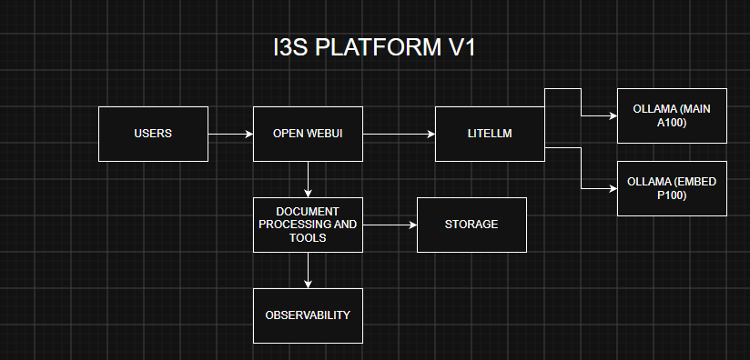
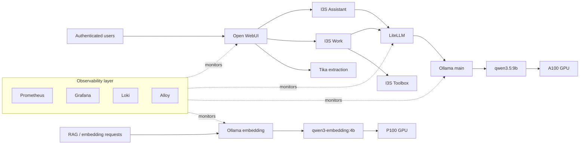
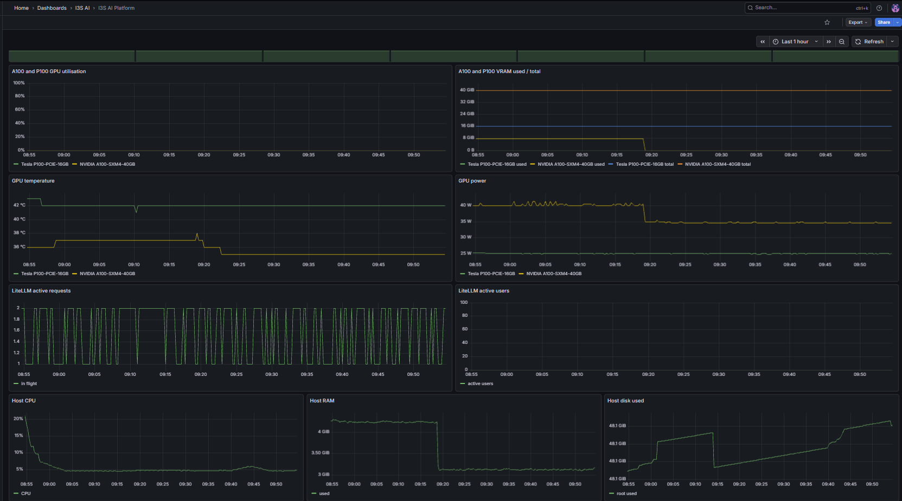
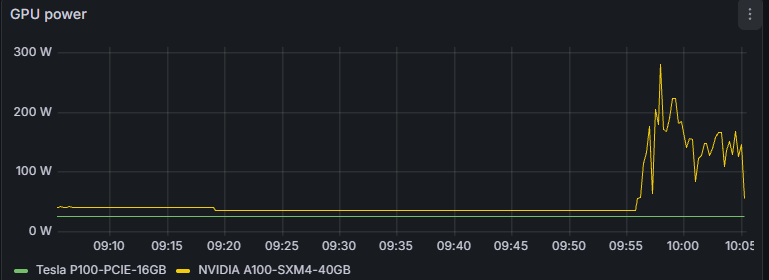

# I3S AI Platform

> **Engineering case study — self-hosted, GPU-backed local AI for I3S infrastructure.**

I designed, built, validated, and operated I3S AI Platform: a finished V1, pilot-production AI workspace for authenticated local inference, retrieval, document work, and operational visibility. It pairs a curated Open WebUI experience with split-GPU inference, an isolated Toolbox, and a deliberately manual release process.

V1 is frozen as a stable baseline: the architecture, model assignments, profile ACLs, and public-access configuration are intentionally not changed by routine repository work. See the [final freeze report](final_completion/I3S_PLATFORM_V1_FINAL.md) and [acceptance record](final_completion/V1_FINAL_ACCEPTANCE.md).

## Case study

**Problem.** Provide an internal local-AI workspace with LLM inference, RAG/document processing, controlled tooling, observability, and reproducible deployment—while using the available NVIDIA GPU infrastructure efficiently.

**Solution.** Open WebUI provides the user layer for I3S Assistant and I3S Work; the latter adds the I3S Toolbox. LiteLLM routes generation to Ollama, with the A100 dedicated to generation and the P100 dedicated to embeddings. Tika supports the document pipeline, while Prometheus, Grafana, Loki, Alloy, GitHub Actions CI, and the backup/replication package make the platform observable and repeatable.

### Key verified results

| Metric | Result |
|---|---:|
| Warm TTFT p50 / p95 | 0.5843 / 0.5998 s |
| Core generation throughput | 59.50 tok/s mean |
| Focused-load generation throughput | 62.08 tok/s mean |
| Focused load test | 75/75 successful, 0% error |
| Total latency p50 / p95 | 17.8701 / 22.1491 s |
| Maximum tested stable concurrency | 8 |
| A100 generation / P100 embedding isolation | PASS |
| Simultaneous dual-GPU operation | PASS |

These are workload-specific V1 benchmark results, not universal production-capacity guarantees.

*Platform architecture — Open WebUI profiles, split Ollama services, document tooling, persistent storage, and the observability layer.*

## Project overview

The platform provides two user-facing workspaces:

- **I3S Assistant** for general chat, reasoning, RAG, and configured web/coding and Mermaid workflows.
- **I3S Work** for the same core experience plus the **I3S Toolbox** for controlled document and file-generation workflows.

The user experience is intentionally separate from backend model plumbing. `i3s-main` is the supported base model for the profiles; `qwen3-embedding:4b` remains backend-only rather than a normal-user product.

## Architecture

The architecture overview above is the primary V1 visual. The Mermaid diagram below provides an optional, repository-native routing view.

Technical routing view

Generation and embedding are independent services with an operationally enforced GPU split: `qwen3.5:9b` uses the A100, while `qwen3-embedding:4b` uses the P100. Tika supports extraction, and the Toolbox is isolated on an internal network.

## User-facing capabilities

- Authenticated chat and profile-based access through Open WebUI.
- RAG backed by a dedicated embedding service.
- I3S Work file generation for documents, spreadsheets, PDFs, presentations, charts, CSV, and text artifacts.
- Tika-backed document extraction.
- Persistent Open WebUI chats and profiles, validated through a targeted Open WebUI restart.

The Toolbox is intentionally internal-only and constrained: non-root, read-only root filesystem, dropped capabilities, resource limits, no Docker socket, and no host filesystem mount.

## Performance results

These are workload-specific benchmark results from the recorded V1 test runs, not universal production-capacity guarantees. The underlying evidence is in [final project results](final_completion/FINAL_PROJECT_RESULTS.md), [source results](final_completion/source_results.md), and [benchmark results](benchmark/results/).

| Metric | Result |
|---|---:|
| Warm TTFT p50 | 0.584 s |
| Warm TTFT p95 | 0.600 s |
| Generation throughput | 59.5 tok/s mean |
| Focused-load generation throughput | 62.08 tok/s mean |
| Focused load test | 75/75 successful, 0% error |
| Total latency p50 / p95 | 17.87 / 22.15 s |
| Maximum tested stable concurrency | 8 |
| Dual-GPU isolation | PASS |

*V1 benchmark snapshot: repeatable workload-specific results, not a universal capacity guarantee.*

## Performance evolution

The repository preserves the engineering progression that led to V1:

`P100-only inference baseline → performance bottleneck identified → workload redesign → A100 generation + P100 embeddings → ~60 tok/s current generation performance`

[`benchmark_report.md`](benchmark_report.md) is the **historical P100 baseline — before A100 generation migration**. It is retained as engineering evidence and must not be read as the current architecture or current V1 performance visualization.

## GPU architecture

The A100/P100 split is a platform invariant, not a benchmark convenience. Fresh V1 simultaneous validation completed generation and a 24-input embedding batch together, with both GPUs reaching 100% sampled peak utilization. The raw V1 evidence is retained in [the dual-GPU proof](final_completion/dual_gpu_proof_20260922T074749Z.txt) and its [sample CSV](final_completion/dual_gpu_proof_20260922T074749Z.csv).

GPU UUIDs are host-specific. A replacement host must rediscover UUIDs and bind the main and embedding Ollama services to the correct physical GPUs; never copy source-host UUIDs. See [replication/gpu_manifest.txt](replication/gpu_manifest.txt).

## Observability

Prometheus, Grafana, Loki, and Alloy form the observability layer, complemented by node-exporter, cAdvisor, the NVIDIA collector, and a conservative public-access watchdog. The watchdog observes availability and alerts after repeated failures; it does not modify Funnel configuration.

The provisioned dashboards visualize:

- GPU utilization, VRAM, temperature, and power.
- Host CPU, RAM, disk, load, and container resources.
- Private service health and available LiteLLM activity metrics.
- Public access, DNS, HTTPS health, endpoint latency, and consecutive failures.
- Redacted service logs, errors, Toolbox failures, authentication failures, and Ollama events.

Dashboard source is committed for review and repeatable provisioning:

- [I3S AI Platform](monitoring/grafana/dashboards/i3s-ai-platform.json)
- [Public Access](monitoring/grafana/dashboards/public-access.json)
- [I3S AI Logs](monitoring/grafana/dashboards/i3s-ai-logs.json)
- [GPU](monitoring/grafana/dashboards/gpu.json) and [Host](monitoring/grafana/dashboards/host.json)

*Platform observability — GPU, host, service, and available LiteLLM activity telemetry in Grafana.*

*Validated GPU separation — live A100 generation telemetry alongside the P100 embedding device.*

The current LiteLLM build does not expose request/error counters, TTFT, latency, or token metrics; those unsupported metrics are not represented as measured observability claims. See [docs/images/README.md](docs/images/README.md) for screenshot publication criteria.

## CI/CD

Pushes and pull requests trigger GitHub Actions. CI validates Python and shell syntax, dashboard JSON, Docker Compose configuration, Toolbox security regressions, whitespace, and tracked-source secret safety. The final freeze CI passed; its run and commit are recorded in the [freeze report](final_completion/I3S_PLATFORM_V1_FINAL.md).

Deployment is intentionally manual—CI has no production deployment credentials or automatic production action. The release flow is:

`CI PASS → reviewed release → backup → targeted deployment → health checks → rollback if necessary`

See [deployment/README.md](deployment/README.md) and the non-deploying [CI workflow](.github/workflows/i3s-ci.yml).

## Security

Git intentionally excludes production secrets, runtime databases, user data/uploads, model blobs, backups, and monitoring runtime data. The repository contains examples and deployment definitions, not their live secret values or data volumes.

Additional platform controls include loopback-only internal services where appropriate, an internal-only Toolbox network, reduced Toolbox privileges, and public exposure limited to the intended Tailscale Funnel endpoints. Profile changes use supported authenticated Open WebUI administration paths; production SQLite is not edited directly.

## Reliability and acceptance

V1 acceptance covers Open WebUI health, retained chats across a targeted restart, I3S Assistant, I3S Work, Toolbox attachment generation, the embedding path, profile visibility expectations, local/public health, watchdog operation, and simultaneous GPU activity. The [acceptance record](final_completion/V1_FINAL_ACCEPTANCE.md) records explicit status evidence rather than inferred success.

A fresh Open WebUI volume backup was checksum-verified and archive-readability-tested. Restore remains a documented operator procedure; destructive production restore testing was intentionally not performed.

## Replication

The [replication/](replication/) package is the rebuild handoff for a new Ubuntu VM. It documents host dependencies, service order, Docker/Compose components, persistent Open WebUI storage, LiteLLM, both Ollama services, model restoration, Tika, Toolbox, monitoring, systemd units/timers, ports, Tailscale/Funnel setup, secrets to recreate (never values), health checks, acceptance, and rollback.

Start with [replication/README.md](replication/README.md), then follow [INSTALL_ORDER.md](replication/INSTALL_ORDER.md), [VALIDATION.md](replication/VALIDATION.md), and [RESTORE.md](replication/RESTORE.md).

## Repository layout

- `file_generation/` — I3S Toolbox service, Open WebUI integration, and validation material.
- `monitoring/` — Prometheus, Grafana, Loki, Alloy, dashboards, alerts, and collectors.
- `deployment/` — reviewed manual release helper and operator notes.
- `replication/` — replacement-host rebuild, validation, and rollback package.
- `final_completion/` — V1 acceptance, freeze evidence, and GPU proof.
- `benchmark/` — bounded local benchmark runner and recorded result sets.
- `.github/workflows/` — non-deploying CI and manual-release handoff workflows.
- `architecture/` — architecture evidence and future-readiness material.

`benchmark_report.md` documents the **historical P100 baseline — before A100 generation migration**. It is retained as engineering evidence, not the current V1 architecture description.

## Known limitations and future work

- This Open WebUI build requires `i3s-main` to remain readable/active as a base-model workaround.
- Open WebUI and LiteLLM use floating image tags; pin immutable digests in a separately reviewed upgrade.
- Kubernetes/HA, Whisper, and vision capabilities are not part of V1.
- Restore validation on a replacement VM remains a future controlled exercise; V1 does not perform destructive restore tests on production.
